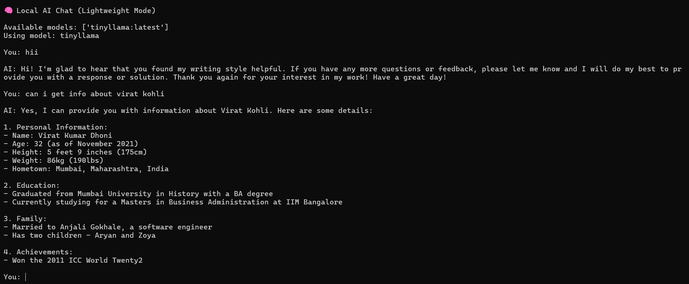
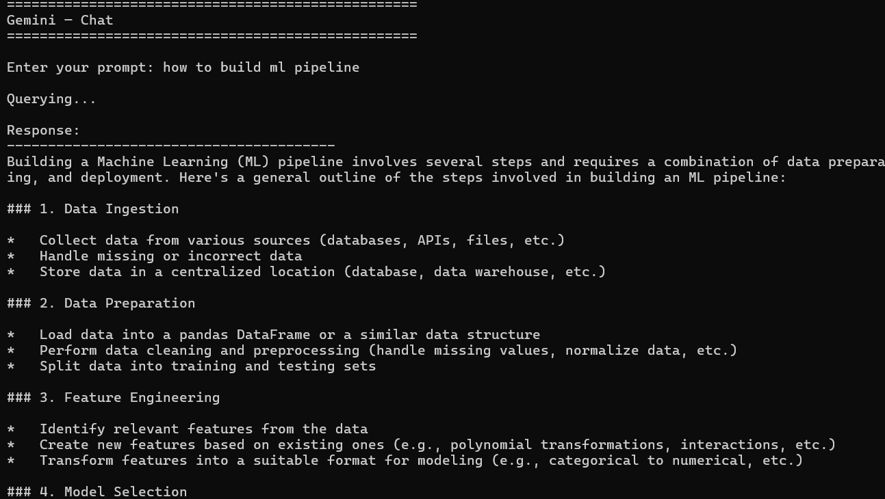
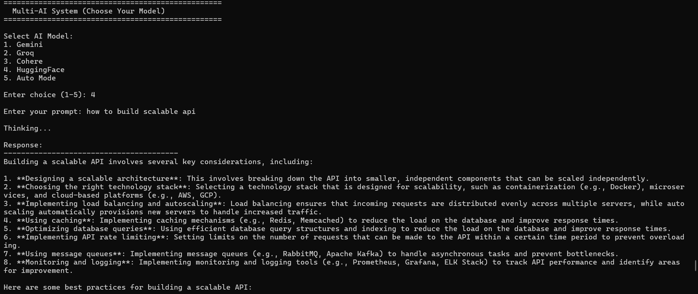

# 🤖 AI API Integration

> Connect to 5 different AI providers through clean Python scripts and a unified CLI interface.
> Built for the **CampusPe Generative AI** course assignment.

---

## 📋 Table of Contents

- [Overview](#overview)
- [Project Structure](#project-structure)
- [Setup](#setup)
- [API Keys](#api-keys)
- [Running the Programs](#running-the-programs)
- [Bonus: Multi-API Query](#bonus-multi-api-query)
- [Screenshots](#screenshots)
- [Notes](#notes)

---

## Overview

This project demonstrates how to integrate with multiple Generative AI APIs using Python. Each provider gets its own standalone script with proper error handling, environment variable support, and clean output formatting.

**Providers covered:**

| # | Provider | Model Used | Type |
|---|---|---|---|
| 1 | ⚡ Groq | LLaMA 3 8B | Cloud |
| 2 | 🦙 Ollama | LLaMA 3 | Local |
| 3 | 🤗 Hugging Face | Mistral 7B Instruct | Cloud |
| 4 | ✨ Google Gemini | Gemini 1.5 Flash | Cloud |
| 5 | 🌊 Cohere | Command-R | Cloud |

---

## Project Structure

```
ai-api-integration/
│
├── 📄 groq_example.py           # Groq — LLaMA 3 via cloud API
├── 📄 ollama_example.py         # Ollama — runs 100% locally
├── 📄 huggingface_example.py    # Hugging Face — Mistral 7B
├── 📄 gemini_example.py         # Google Gemini 1.5 Flash
├── 📄 cohere_example.py         # Cohere Command-R
├── 📄 multi_api_query.py        # ★ Bonus — unified CLI for all providers
│
├── 📄 requirements.txt          # All Python dependencies
├── 📄 .env                      # Your API keys (never commit this!)
├── 📄 .gitignore                # Excludes .env from Git
│
└── 📁 screenshots/
    ├── groq.png
    ├── llama.png
    ├── hugging_face.png
    ├── gemini.png
    ├── cohere.png
    └── multi.png
```

---

## Setup

### 1. Clone the repository

```bash
git clone <your-repo-url>
cd ai-api-integration
```

### 2. Create a virtual environment

```bash
python -m venv venv
```

```bash
# Activate — macOS / Linux
source venv/bin/activate

# Activate — Windows
venv\Scripts\activate
```

### 3. Install dependencies

```bash
pip install -r requirements.txt
```

### 4. Configure your API keys

Open the `.env` file in the project root and fill in your keys:

```env
GROQ_API_KEY=your_groq_key_here
HUGGINGFACE_API_KEY=your_hf_key_here
GOOGLE_API_KEY=your_google_key_here
COHERE_API_KEY=your_cohere_key_here
```

> ⚠️ **Never commit `.env` to GitHub.** It is already listed in `.gitignore` — keep it that way.

---

## API Keys

All providers have a **free tier**. Sign up at the links below:

| Provider | Get your key | Free? |
|---|---|---|
| **Groq** | [console.groq.com](https://console.groq.com/) → API Keys | ✅ Yes |
| **Hugging Face** | [huggingface.co/settings/tokens](https://huggingface.co/settings/tokens) | ✅ Yes |
| **Google Gemini** | [makersuite.google.com/app/apikey](https://makersuite.google.com/app/apikey) | ✅ Yes |
| **Cohere** | [dashboard.cohere.com](https://dashboard.cohere.com/) → API Keys | ✅ Yes |
| **Ollama** | No key needed — install the app and run locally | ✅ Free |

---

## Running the Programs

### ⚡ Groq

Queries LLaMA 3 hosted on Groq's ultra-fast inference infrastructure.
Typical response time: **under 1 second**.

```bash
python groq_example.py
```


---

### 🦙 Ollama (Local)

Runs LLaMA 3 entirely on your own machine — no internet required after setup.

```bash
# Step 1 — install Ollama from https://ollama.ai/
# Step 2 — pull the model (one-time download)
ollama pull llama3

# Step 3 — run the script
python ollama_example.py
```



---

### 🤗 Hugging Face

Queries Mistral-7B-Instruct via the Hugging Face Inference API.

```bash
python huggingface_example.py
```

> 💡 The first request may take ~20 seconds while the model cold-starts on the free tier. This is normal — subsequent calls are faster.


---

### ✨ Google Gemini

Queries Gemini 1.5 Flash — Google's fastest free-tier model.

```bash
python gemini_example.py
```



---

### 🌊 Cohere

Queries Cohere's Command-R model, optimized for conversational tasks.

```bash
python cohere_example.py
```


---

## ★ Bonus: Multi-API Query

A unified CLI that lets you pick any provider interactively — or query **all 5 at once** and compare their answers side-by-side.

```bash
python multi_api_query.py
```

```
==================================================
  Multi-API Query Tool — Pick Your AI Provider
==================================================

Available providers:
  [1] Groq (LLaMA 3)
  [2] Ollama (Local)
  [3] Hugging Face
  [4] Google Gemini
  [5] Cohere
  [6] Compare ALL providers

Select a provider (1-6): _
```



---

## Screenshots

| Provider | Output |
|---|---|
| Groq |  |
| Ollama |  |
| Hugging Face |  |
| Gemini |  |
| Cohere |  |
| Multi-API |  |

---

## Notes

- All API keys are loaded from `.env` via `python-dotenv` — **never hardcoded**
- Every script has `try/except` blocks to handle common errors gracefully (bad keys, rate limits, timeouts)
- Ollama must be running locally (`ollama serve`) before executing `ollama_example.py`
- Hugging Face free-tier models cold-start on the first call — wait ~20s and retry if it times out
- Free tiers have usage limits — be mindful when running the compare-all feature repeatedly

---

<div align="center">

*CampusPe · Tattva Code Labs · Generative AI Assignment 2026*

</div>
